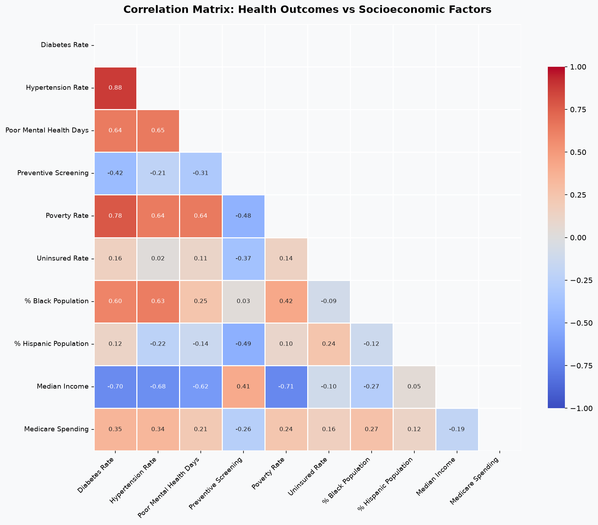
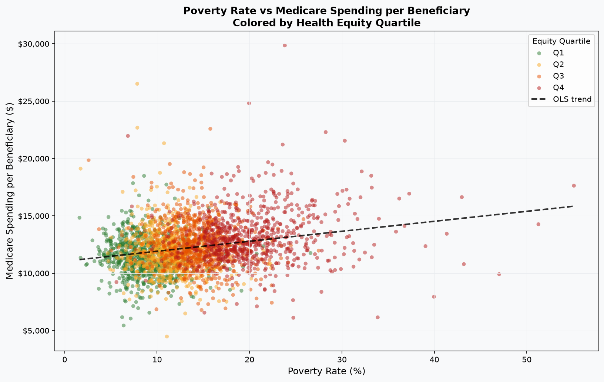
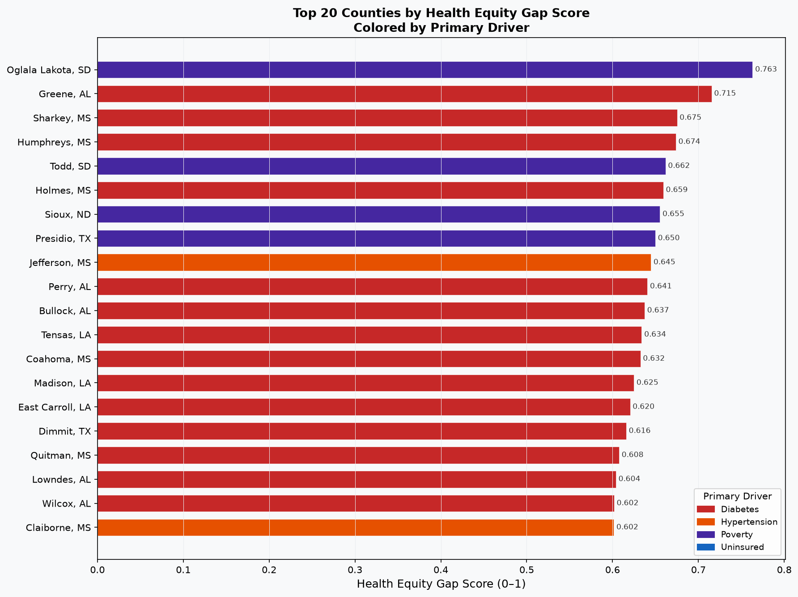

# EquiCare: Health Equity Gap Analyzer

> **Health inequity costs Medicare an estimated $9.5 billion annually.**  
> Counties in the worst equity quartile spend **$1,818 more per beneficiary** than the healthiest quartile — a statistically significant gap (p < 0.000001) driven by diabetes, hypertension, poverty, and lack of insurance.

Built with CDC PLACES, CMS Medicare Geographic Variation, and US Census ACS data across **3,143 US counties**.

---

## Live Dashboard

**[View on Tableau Public](https://public.tableau.com/authoring/EquiCareHealthEquityGapAnalyzer/Dashboard1#1)**



---

## Key Findings

### Medicare Spending Gap
| Quartile | Avg Spending/Beneficiary | Avg Poverty Rate | Avg Diabetes Rate |
|----------|--------------------------|------------------|-------------------|
| Q1 (Best equity) | $11,382 | 8.8% | 9.8% |
| Q2 | $11,873 | 11.4% | 11.4% |
| Q3 | $12,487 | 14.3% | 12.8% |
| Q4 (Worst equity) | $13,200 | 20.3% | 15.7% |

**T-test: Q4 vs Q1 mean difference = $1,817.67 (t=17.57, p < 0.000001)**

### Top Correlations (Pearson, all p < 0.000001)
| Variable 1 | Variable 2 | r |
|------------|------------|---|
| Diabetes Rate | Poverty Rate | **0.776** |
| Diabetes Rate | Median Income | -0.694 |
| Hypertension Rate | Median Income | -0.681 |
| Mental Health Poor Days | Poverty Rate | 0.643 |
| Hypertension Rate | Poverty Rate | 0.639 |

### OLS Regression: Medicare Spending ~ Health + Socioeconomic Factors
- **R² = 0.151** (F-statistic = 105.1, p < 0.000001)
- Significant predictors: uninsured rate (p<0.001), diabetes rate (p<0.001), hypertension rate (p<0.001), median income (p<0.001)
- Poverty rate NOT independently significant after controlling for other factors (p=0.691)

### States with Highest Q4 County Concentration
| State | Q4 Counties | Mean Spending |
|-------|-------------|---------------|
| TX | 89 | $14,070 |
| GA | 88 | $12,531 |
| MS | 68 | $14,890 |
| AL | 50 | $13,148 |
| LA | 48 | $14,799 |

---

## Visualizations

### Correlation Heatmap


### Poverty Rate vs Medicare Spending (by Equity Quartile)


### Top 20 Worst Counties by Equity Gap Score


---

## Methodology

### Data Sources
| Source | API | Records |
|--------|-----|---------|
| CDC PLACES 2023 | `data.cdc.gov/resource/swc5-untb.json` | 3,143 counties |
| CMS Medicare Geographic Variation 2024 | `data.cms.gov/data-api/v1/dataset/...` | 3,144 counties |
| US Census ACS 5-Year 2022 | `api.census.gov/data/2022/acs/acs5` | 3,222 counties |

### Equity Gap Score
Composite score weighted across four normalized (MinMax) dimensions:
- Diabetes rate: **30%**
- Hypertension rate: **25%**
- Poverty rate: **25%**
- Uninsured rate: **20%**

### Statistical Methods
- **Pearson correlation** with p-value testing across all health x socioeconomic variable pairs
- **OLS Multiple Linear Regression** (statsmodels): Medicare spending ~ socioeconomic + health factors
- **Welch's independent samples t-test**: Q4 vs Q1 spending comparison
- **MinMaxScaler** normalization before composite scoring
- **Quartile segmentation** via pandas qcut

### Pipeline
```
CDC PLACES API -> cdc_health_outcomes (SQLite)
CMS Medicare API -> cms_spending (SQLite)
Census ACS API  -> census_demographics (SQLite)
                        |
                   JOIN on FIPS
                        |
              Equity Gap Score + OLS + T-test
                        |
              4 charts + Tableau CSV + findings.md
```

---

## Project Structure
```
EquiCare/
├── src/
│   ├── data_collection/
│   │   ├── cdc_places.py        # CDC PLACES county health outcomes
│   │   ├── cms_spending.py      # CMS Medicare spending by county
│   │   └── census_acs.py        # US Census ACS demographics
│   ├── analysis/
│   │   ├── statistics.py        # Pearson, OLS, t-test
│   │   ├── equity_score.py      # Composite equity gap scoring
│   │   ├── export.py            # Tableau CSV export
│   │   └── report.py            # findings.md generation
│   └── visualization/
│       └── charts.py            # 4 matplotlib/seaborn charts
├── output/
│   ├── equicare_tableau.csv     # 2,954 rows, Tableau-ready
│   ├── findings.md              # Executive summary
│   ├── worst_counties.csv       # Top 20 worst counties
│   ├── state_summary.csv        # State-level aggregates
│   └── *.png                    # 4 chart images
├── data/
│   └── equicare.db              # SQLite (gitignored)
├── main.py
└── .env                         # CENSUS_API_KEY (gitignored)
```

## Setup
```bash
pip install -r requirements.txt
echo CENSUS_API_KEY=your_key_here > .env
python main.py
```

No OpenAI key required. All data is free and publicly available.

---

*Built by [Dharshana Reddy](https://www.linkedin.com/in/r-dharshana-reddy/) — Data Analyst*
